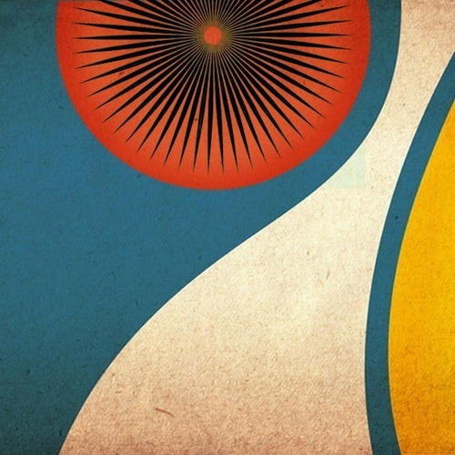

<AudioPlayer source={'http://traffic.libsyn.com/reverberationradio/Reverberation_133.mp3'} />

<strong>Reverberation #133<a href="http://traffic.libsyn.com/reverberationradio/Reverberation_133.mp3" target="_blank"> download </a></strong>1. Freedom (Hourya) - Abadane 2. The Bates - El Stomp &amp; Mar&iacute;a Es El Nombre&nbsp; 3. The Nightcrawlers - The Last Ship 4. Sun Ra - Night of the Purple Moon 5. Dominic Frontiere - I Believe 6. Felt - Vasco de Gama 7. Chick Corea &amp; Gary Burton - Children's Song 8. The Association - Remember 9. Ariel Pink's Haunted Graffiti - Reminiscences&nbsp; 10. Spur - You Could Help Me Ease the Pain

