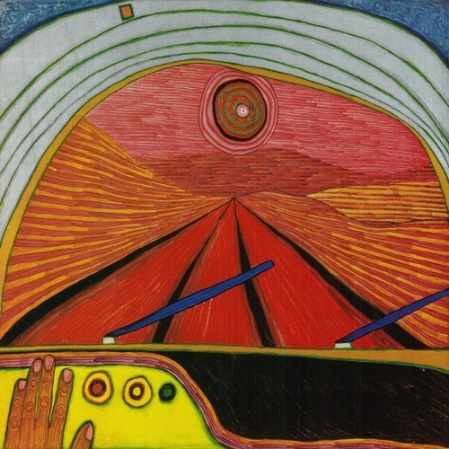

<AudioPlayer source={'https://traffic.libsyn.com/reverberationradio/Reverberation_136.mp3'} />

<strong>Reverberation #136</strong> <strong><a href="https://traffic.libsyn.com/reverberationradio/Reverberation_136.mp3"><strong>download</strong> </a></strong>1. Holy Barbarians - Arroyo Seco 2. Dirt Dress - Revelations 3. Adam Leonard - I'm Gonna Sleep With Myself [Tonight] 4. Shigeo Sekito - The Word II 5. Benny Soebardja And Lizard - Candle Light 6. Peaking Lights - Everyone and Us 7. Hank Levine &amp; The Blazers - Midnight 8. The Molochs - Sleep In Doom 9. David Lynch &amp; Alan R. Splet - In Heaven (Lady in the Radiator Song) 10. Le Seigneur Rochereau - Joujou Zewa 11. Billy Changer - Black Angel

