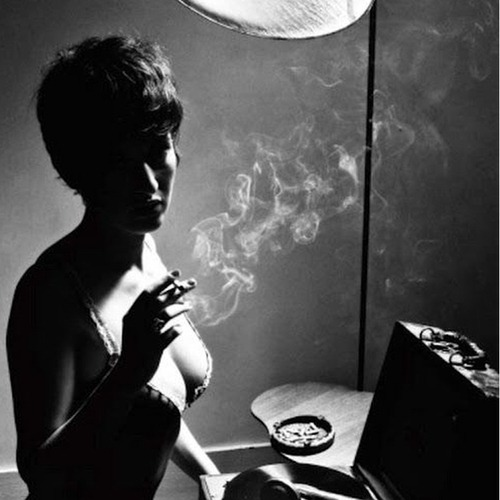

<AudioPlayer source={'https://traffic.libsyn.com/reverberationradio/Reverberation_141.mp3'} />

<strong>Reverberation #141 </strong><strong><a href="https://traffic.libsyn.com/reverberationradio/Reverberation_141.mp3" title="download" target="_blank">download </a></strong>1. Mimi &amp; Richard Fari&ntilde;a - Sell-Out Agitation Waltz 2. Horace Silver - The Jody Grind 3. Fred Neil - Everybody's Talkin' (Live) 4. The Knight Brothers - Tried So Hard To Please Her 5. Van Morrison - Coming Down To Joy 6. Betty Harris - Trouble With My Lover 7. The Tams - You Might As Well Forget Him 8. Bobby Womack - See Me Through 9. Buzz Clifford - Magic Circle 10. The Clarendonians - I Can't Go On 11. Dan Penn - Rainbow Road

