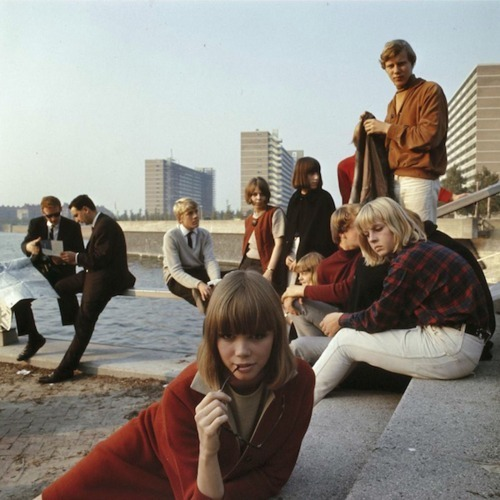

<AudioPlayer source={'http://traffic.libsyn.com/reverberationradio/Reverberation_142.mp3'} />

<strong>Reverberation #142 </strong><strong><a href="http://traffic.libsyn.com/reverberationradio/Reverberation_142.mp3" title="download" target="_blank">download </a></strong>1. Q65 - I Was Young 2. O.P.M.C - The Head 3. Met &amp; Zonder - Now I Know 4. The Motions - Make It Legal 5. The Bumblebees - Maybe Someday 6. Mother's Love - Highway To Heaven 7. The Cats - Magical Mystery Morning 8. Boudewijn de Groot - Picknick 9. The Zipps - Lotus Love (demo) 10. Cinderella - From Town To Town 11. Les Baroques - Love Is The Sun 12. Mayfly - Topless Berth

