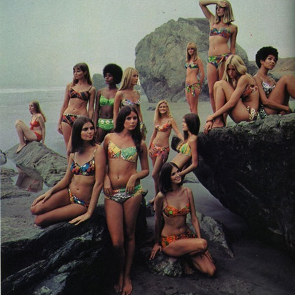

<AudioPlayer source={'https://traffic.libsyn.com/reverberationradio/Reverberation_143.mp3'} />

<strong>Reverberation #143 </strong><strong><a href="https://traffic.libsyn.com/reverberationradio/Reverberation_143.mp3" title="download" target="_blank">download </a></strong>1. Pisano &amp; Ruff - The Drifter 2. Pete Jolly - Autumn Festival 3. Sergio Mendes &amp; Brasil 77 - After Sunrise 4. Antonio Carlos Jobim - Batidinha 5. Claudine Longet - Who Needs You 6. Chris Montez - Spooky 7. Nick De Caro - I&rsquo;m Gonna Make You Love Me 8. Peter C. Johnson - Giorgio&rsquo;s Dilemma 9. Michelle Phillips - Aching Kind 10. The Flying Burrito Brothers - Here Tonight 11. Fairport Convention - Tale In Hard Time 12. Letta Mbulu - There&rsquo;s Music In The Air

