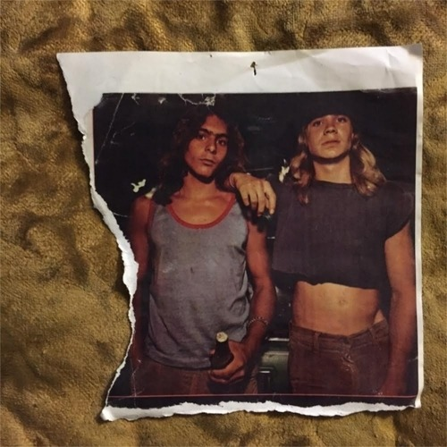

<AudioPlayer source={'https://traffic.libsyn.com/reverberationradio/Reverberation_146.mp3'} />

<strong>Reverberation #146 </strong><strong><a href="https://traffic.libsyn.com/reverberationradio/Reverberation_146.mp3" title="download" target="_blank">download </a></strong>1. Javier Bergia - Midnight Round Mekines 2. Ghetto Brothers - Viva Puerto Rico Libre 3. Michel Magne &amp; His Orchestra - Besame Mucho 4. The Grim Reapers - Joanne 5. Joe Pass - A Time For Us 6. Tibble - We Went For A Drive 7. Holger Czukay - Ode to Perfume 8. Mark Almond - The Ghetto 9. Tobias Jesso Jr. - Just A Dream

