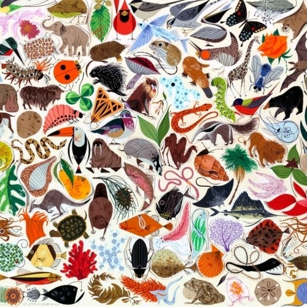

<AudioPlayer source={'https://traffic.libsyn.com/reverberationradio/Reverberation_149.mp3'} />

<strong>Reverberation #149 </strong><strong><a href="https://traffic.libsyn.com/reverberationradio/Reverberation_149.mp3" title="download" target="_blank">download </a></strong>1. Kim Fowley - Bubble Gum 2. The Sandpipers - Things We Said Today 3. Electric Light Orchestra - First Movement (Jumpin' Biz) 4. Ariel Pink - Black Ballerina 5. The Bards - Thanks A Lot Baby 6. Mulato Of Ethiopia - Mascaram Seteba 7. The Abigails - It's Nothing To Me 8. Edward Bear - Edgware Station 9. Cryan' Shames - She Don't Care About Time 10. Cal Tjader - Armando's Guajira 11. T&aacute;rtaros - Beijos Teus

