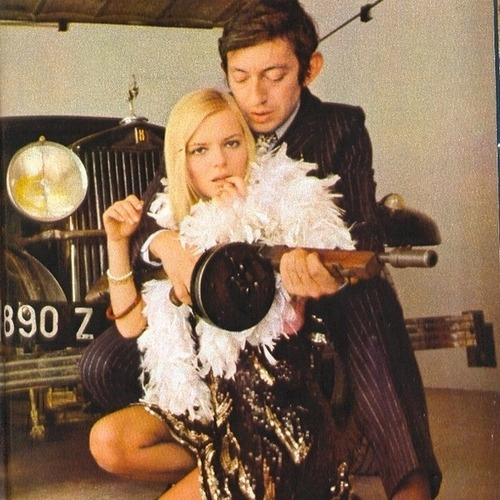

<AudioPlayer source={'https://traffic.libsyn.com/reverberationradio/Reverberation_154.mp3'} />

<b>Reverberation #154 </b><b><a href="https://traffic.libsyn.com/reverberationradio/Reverberation_154.mp3">download</a> </b>1. Les Surfs - If You Please 2. Les Papyvores - Le Papyvore 3. Daniel Gerard - Sexologie 4. Prince De Baroda - Que C'est Triste Un Monde Sans Amour 5. Serge Gainsbourg - Ah! Melody 6. France Gall - Chanson Pour Que Tu M'aimes Un Peu 7. Pierre Cavalli - Un Soir Chez Norris 8. Jacqueline Ta&iuml;eb - Ce Soir Je M'en Vais 9. Alice Dona - C'est Pas Prudent 10. Marie Lafor&ecirc;t - Et Si Je T'aime 11. Jacques Dutronc - Amour Toujours Tendresse Caresse 12. Brigitte Bardot - Contact

