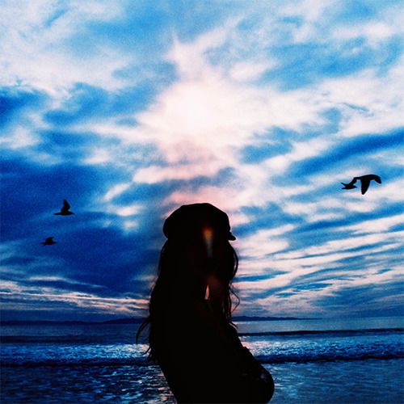

<AudioPlayer source={'http://traffic.libsyn.com/reverberationradio/Reverberation_159.mp3'} />

<b>Reverberation #159 </b><b><a href="http://traffic.libsyn.com/reverberationradio/Reverberation_159.mp3">download</a> </b>1. Leonard Nimoy - A Visit To A Sad Planet (Intro) 2. Q '65 - The Life I Live 3. The Poppy Family - Where Evil Grows 4. James Gang - Yadig 5. 13th Floor Elevators - Dr. Doom 6. Dion &amp; The Belmonts - Baby You've Been On My Mind 7. Nico Gomez et Son Orchestre - Aquarela 8. West - The Dolphins 9. Ted Lucas - Now That I Know 10. Earth And Fire - Twilight Dreamer 11. Traffic Sound - Meshkalina 12. Leonard Nimoy - A Visit To A Sad Planet (Outro)

