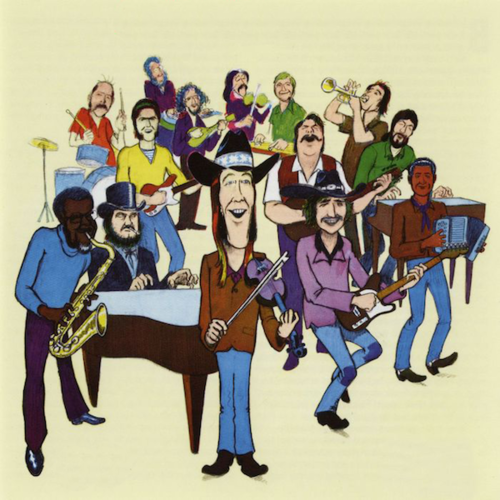

<AudioPlayer source={'https://traffic.libsyn.com/reverberationradio/Reverberation_166.mp3'} />

<b>Reverberation #166 <a href="https://traffic.libsyn.com/reverberationradio/Reverberation_166.mp3">download</a></b> 1. Groupe Folklorique Montagnais - Tshekuan Mak Tshetutamak 2. Daniel Moore - May 16, '75 3. Nilsson &amp; Cher - A Love Like Yours (Don't Come Knocking Every Day) 4. Greenwood, Curlee and Clyde - Changes 5. Smokey and His Sister - Where There's Fire 6. Tim Dawe - Nothing At All 7. Louie and The Lovers - Forgive Me This Time 8. Doug Sahm - It's Gonna Be Easy 9. Tim Hollier - And It's Happening To Her 10. Lee Hazlewood - A Rider On A White Horse

