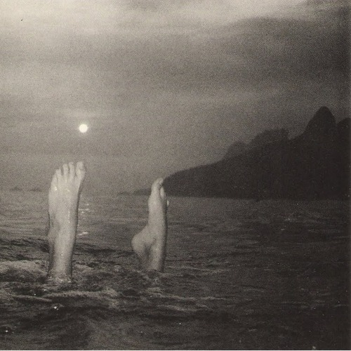

<AudioPlayer source={'http://traffic.libsyn.com/reverberationradio/Reverberation_168.mp3'} />

<b>Reverberation #168 </b><b><a href="http://traffic.libsyn.com/reverberationradio/Reverberation_168.mp3">download</a> </b>1. Chico Buarque - Jorge Maravilha 2. Quarteto Em Cy - Tudo Que Voc&ecirc; Podia Ser 3. The Stranglers - Golden Brown 4. Avid Dancer - Long Journey 5. Cassiano - Onda 6. Sly Stone - Just Like A Baby 7. Christine McVie - And That&rsquo;s Saying A Lot 8. Drug Cabin - Steely Dad 9. The Dying Shames - Marquess 10. Tones On Tail - Lions

