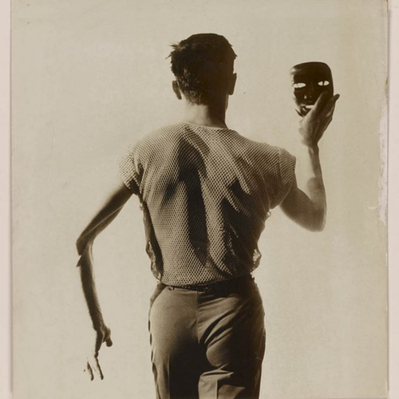

<AudioPlayer source={'https://traffic.libsyn.com/reverberationradio/Reverberation_171.mp3'} />

<b>Reverberation #171 <a href="https://traffic.libsyn.com/reverberationradio/Reverberation_171.mp3">download</a> </b>1. Erik Montry - L&rsquo;eau Qui Dort 2. Dion - Knowing I Won&rsquo;t Go back There 3. Kenny Lynch - Puff (Up In Smoke) 4. Josephine Sunday - Don&rsquo;t Let Your Mind Rule Your Heart&nbsp; 5. Adam Wade - Rain From The Skies 6. Timi Yuro - Insult To Injury 7. The Escorts - You Can&rsquo;t Even Be My Friend 8. Dee Clark - Warm Summer Breezes 9. Beverly McKay - Baby You&rsquo;re So Right 10. Patti &amp; The Emblems - You Took Advantage Of A Good Thing

