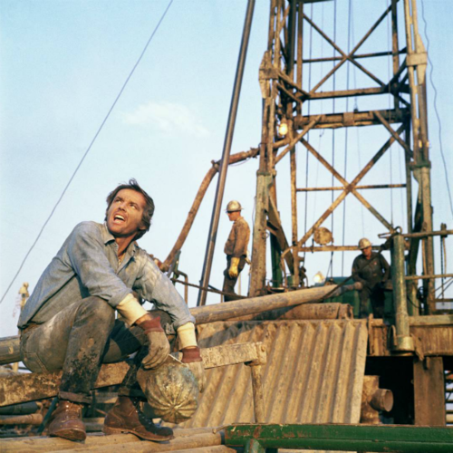

<AudioPlayer source={'http://traffic.libsyn.com/reverberationradio/Reverberation_176.mp3'} />

<b>Reverberation #176 <a href="http://traffic.libsyn.com/reverberationradio/Reverberation_176.mp3">download</a></b> 1. Red Rhodes - Jay's Tune 2. Link Wray - La De Da 3. Dik Dik - Lo Mi Fermo Qui 4. Harry Nilsson - The Beehive State 5. Sir Douglas Quintet - At The Crossroads 6. The Cookies - I Never Dreamed 7. David Wiffen - No Expectations 8. Arthur Russell - Love Is Overtaking Me 9. The Sparrow - Isn't It Strange 10. John Compton - Short Lands

