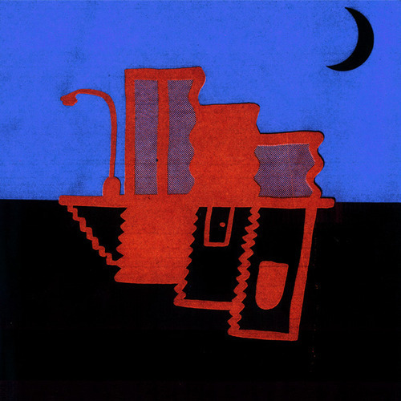

<AudioPlayer source={'https://traffic.libsyn.com/reverberationradio/Reverberation_179.mp3'} />

<b>Reverberation #179 </b><b><a href="https://traffic.libsyn.com/reverberationradio/Reverberation_179.mp3">download</a> </b>&#8203;1. War - So 2. Moebius &amp; Plank - Two Oldtimers (Part One) 3. Stereolab - Brakhage 4. Moebius &amp; Plank - Two Oldtimers (Part Two) 5. The Kinks - I Go To Sleep (Demo) 6. Speed, Glue &amp; Shinki - Don't Say No 7. Look Blue Go Purple - As Does The Sun 8. Slapp Happy - Sort Of 9. Moe Tucker - Will You Love Me Tomorrow? 10. Serge Bulot - Jungle's Orchestra

