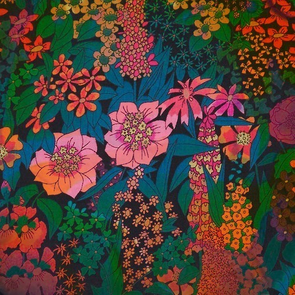

<AudioPlayer source={'https://traffic.libsyn.com/reverberationradio/Reverberation_183.mp3'} />

<b>Reverberation #183 <a href="https://traffic.libsyn.com/reverberationradio/Reverberation_183.mp3">download</a></b> 1. Gemini II E O'Seis - Lindo 2. Cliff Richard - Evergreen Tree 3. Kenny Brent &amp; Donna Harris - Shadows Of You 4. Boys Age - Forbidden Summer 5. Follies Bazaar - Blue Sea 6. Rikki Ililonga - Angel Black 7. Fran&ccedil;oise Hardy - L'Amiti&eacute; 8. Jim Sullivan - Lonesome Picker 9. The Afro Soul-Tet - Sand, Sun And Sea 10. Tammi Terrell &amp; Marvin Gaye - Hold Me Oh My Darling 11. Pink Floyd - Lucy Leave

