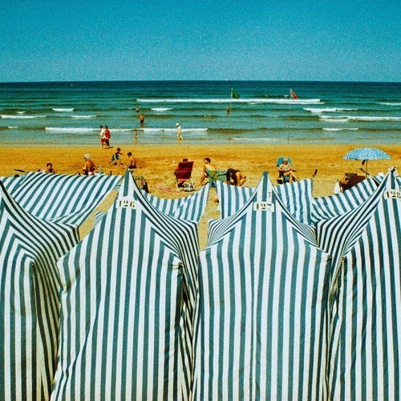

<AudioPlayer source={'https://traffic.libsyn.com/reverberationradio/Reverberation_188.mp3'} />

<b>Reverberation #188 </b><b><a href="https://traffic.libsyn.com/reverberationradio/Reverberation_188.mp3">download</a> </b>1. Harumi - Hunters Of Heaven 2. Sai Nobu - The World Of Light Blue 3. Los Yorks - Mi Mente En Ti 4. Samuel Belay - Lebene Sheweshew 5. Mulatu Astatke - I Faram Gami I Faram 6. Jean Le Fennec - L'abandon 7. John Maus - Maniac 8. Duo Tsafri - I Keep The Shabbat 9. The Monkees ft. Neil Young - You And I 10. Paul McCartney - Uncle Albert/Admiral Halsey

