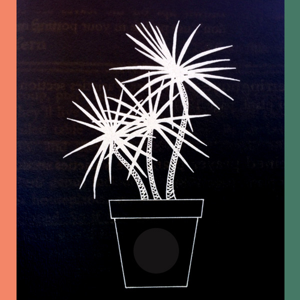

<AudioPlayer source={'http://traffic.libsyn.com/reverberationradio/Reverberation_192.mp3'} />

<b>Reverberation #192 <a href="http://traffic.libsyn.com/reverberationradio/Reverberation_192.mp3">download</a></b> 1. Will Ivy - If I Was A Painter 2. War - Don't Let Nobody Get You Down 3. Macrame - Mancunian Boys 4. Serge Gainsbourg - New York-U.S.A. 5. The International Submarine Band - Sum Up Broke 6. The Ponys - I Love You 'Cause (You Look Like Me) 7. Television Personalities - Anxiety Block 8. Tim Cohen - Bad Blood 9. Josef K - It's Kinda Funny 10. Mac DeMarco - Baby's Wearing Blue Jeans 11. Dee Dee Warwick - We're Doing Fine

