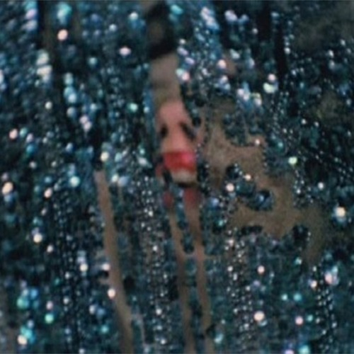

<AudioPlayer source={'https://traffic.libsyn.com/reverberationradio/Reverberation_196.mp3'} />

<b>Reverberation #196 </b><b><a href="https://traffic.libsyn.com/reverberationradio/Reverberation_196.mp3">download</a> </b>1. Mild High Club - Windowpane 2. Connan Mockasin - It's Choade My Dear 3. Dungen - Vara Snabb 4. Sugar Candy Mountain - Windows 5. Usha Khanna - Hotel Incidental Music (edit)&#8203; 6. Ja'afar Hassan - Palestinian 7. The Panthers - Bhairvi 8. Les Abranis - Chenagh Le Blues 9. Kamuran Akkor - &#304;kimiz Bir Fidan&#305;z

