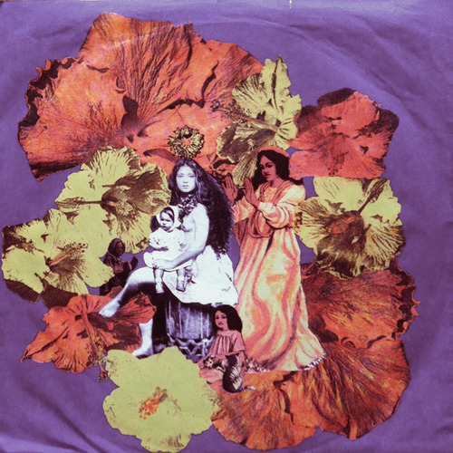

<AudioPlayer source={'https://traffic.libsyn.com/reverberationradio/Reverberation_197.mp3'} />

<b>Reverberation #197 </b><b><a href="https://traffic.libsyn.com/reverberationradio/Reverberation_197.mp3">download</a> </b>1. Willie Loco Alexander - Gin 2. The Poppy Family - Beyond The Clouds 3. Listening - Stoned Is 4. Laghonia - My Love 5. Jan &amp; Dean - California Lullaby 6. Eddie Callahan - Just Across The Line 7. Heron - Smiling Ladies 8. Bridget St. John - Early Morning Song 9. Nick Drake - Saturday Sun 10. The Memories - Gentle

