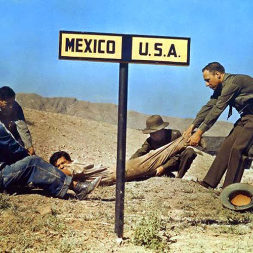

<AudioPlayer source={'https://traffic.libsyn.com/reverberationradio/Reverberation_198.mp3'} />

<b>Reverberation #198 </b><b><a href="https://traffic.libsyn.com/reverberationradio/Reverberation_198.mp3">download</a> </b>1. Bob Fryfogle - Six Feet Under 2. Bob Hocke and The Swamp Rats - I'm Comin' Home 3. Pete Morticelli - Lost 4. Norman Greenbaum - Gondoliers, Shakespeares, Overseers, Playboys and Bums 5. Robert Lester Folsom - Situations 6. Antonio Carlos Jobim - Mojave 7. Jens Lekman - Black Cab 8. G. Wayne Thomas - Gypsy Shoes 9. Johnny Thunders - You Can't Put Your Arms Around A Memory 10. The Cramps - Lonesome Town 

