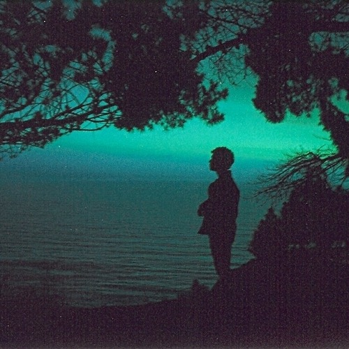

<AudioPlayer source={'https://traffic.libsyn.com/reverberationradio/Reverberation_200.mp3'} />

<b>Reverberation #200</b> <a href="https://traffic.libsyn.com/reverberationradio/Reverberation_200.mp3">&#9729;</a> 1. Up 'N Adam - Rainmaker 2. Steve Elliot - I Wonder 3. ERIC - Morning Lighthouse 4. Steve Elliott - One More Time 5. 4th Coming - Cruising Central Ave. 6. Doug Hream Blunt - Trek 7. Rainman - You Will Be Freed By Me 8. Lady June - To Whom It May Concern 9. Jeff - Minuit Moins I'Quart 10. David Bedford - Sad And Lonely Faces

