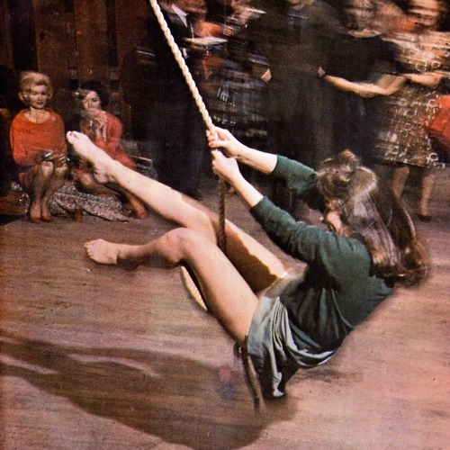

<AudioPlayer source={'http://traffic.libsyn.com/reverberationradio/Reverberation_206.mp3'} />

<b>Reverberation #206 </b><a href="http://traffic.libsyn.com/reverberationradio/Reverberation_206.mp3">&#9729;</a> 1. The Cherokees - Uprising 2. Bud &amp; Kathy - Hang It Out To Dry 3. Earl Connelly - This Girl 4. The Revels - Comanche 5. The Megatons - Isis 6. Ganim&rsquo;s Asia Minors - Daddy Lolo 7. Debonaires - Dorothy 8. Jack Nitzsche - Night Walker 9. Mimi &amp; Richard Fari&ntilde;a - House Un-American Blues Activity Dream 10. The Everly Brothers - June Is As Cold As December

