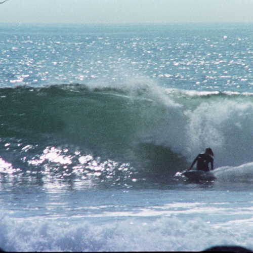

<AudioPlayer source={'https://traffic.libsyn.com/reverberationradio/Reverberation_207.mp3'} />

<b>Reverberation #207 </b><a href="https://traffic.libsyn.com/reverberationradio/Reverberation_207.mp3">&#9729;</a> 1. Creations Unlimited - Chrystal Illusions 2. Giuliano Sorgini - Mad Town 3. Jackie Mittoo - Ghetto Organ 4. Juan Pablo Torres - Extracto De Son 5. The Memories - North Figueroa Street 6. Giuliano Sorgini - Slaves 7. Janko Nilovic - Tapatapa 8. I Marc 4 - Passeggiata 9. Alessandro Alessandroni &amp; I Marc 4 - Acque Azzurre 10. The Crusaders - Look Beyond The Hill

