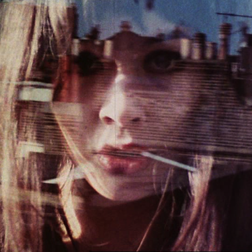

<AudioPlayer source={'http://traffic.libsyn.com/reverberationradio/Reverberation_215.mp3'} />

<b>Reverberation #215 </b><b><a href="http://traffic.libsyn.com/reverberationradio/Reverberation_215.mp3">&#9729;</a> </b>1. Intrinsic Trance - Hey Policeman! 2. Gil Scott-Heron - Angel Dust 3. Johnny "Guitar" Watson - Lovin' You 4. Garland Jeffreys - Wild In The Streets 5. Pisces - Motley Mary Ann 6. Maston - Swans 7. Kourosh Yaghmaei - Reyhan 8. Rachid &amp; Fethi - Mexico 9. Sir Douglas Quintet - And It Didn't Even Bring Me Down 

