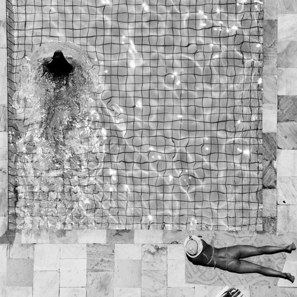

<AudioPlayer source={'https://traffic.libsyn.com/reverberationradio/Reverberation_221.mp3'} />

<b>Reverberation #221 <a href="https://traffic.libsyn.com/reverberationradio/Reverberation_221.mp3">&#9729;</a></b> 1. Lee Hazlewood - Them Girls 2. Maurice Monk - Hi Baby 3. Allah-Las - Famous Phone Figure 4. Cooley-Munson - I Need A Change 5. The Art Museums - So Your Baby Doesn&rsquo;t Love You Anymore 6. Wyld - Goin&rsquo; Places 7. The Pesos - High Hopes 8. Gary and The Universals - The Fifth Dimension 9. Khruangbin - White Gloves 10. The Ripe - Magic Eyes

