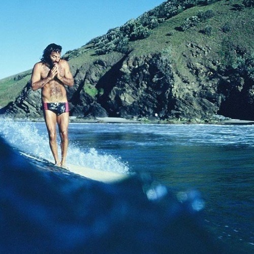

<AudioPlayer source={'https://traffic.libsyn.com/reverberationradio/Reverberation_228.mp3'} />

<b><a href="https://traffic.libsyn.com/reverberationradio/Reverberation_228.mp3">Reverberation #228</a></b> 1. Lennie Hibbert - Lights 2. Robert Lester Folsom - Spanish Lady 3. Looking Glass - Brandy 4. McGuinn, Clark &amp; Hillman - Long Long Time 5. Todd Rundgren - I Saw The Light 6. Gerry Rafferty - Right Down The Line 7. Fe 59 - Estoy Brillando 8. George McCrea - Rock Your Baby 9. Hot Chocolate - Every 1's A Winner 10. Lennie Hibbert - Village Soul

