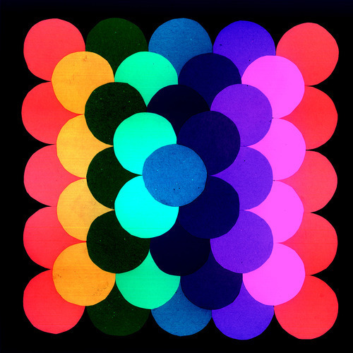

<AudioPlayer source={'https://traffic.libsyn.com/reverberationradio/Reverberation_232.mp3'} />

<b><a href="https://traffic.libsyn.com/reverberationradio/Reverberation_232.mp3">Reverberation #232</a> </b>1. King Sporty - Give You My Love 2. Bernard Chambret - Easy Lazy Lizzie 3. Dylan Shearer - Stop Drop Illuminating 4. Tribe - Zuma House Bop 5. The Vanitys - So Far Away 6. The Scrotem Poles &nbsp;- Pick the Cats Eyes Out 7. NRBQ - Rocket No. 9 8. Betty Wright - Girls Can't Do What The Guys Do 9. Keith Hudson - Man From Shooters Hill 10. Sun Araw - Bump Up

