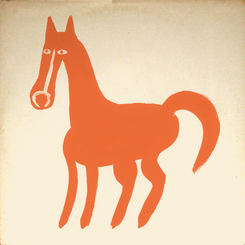

<AudioPlayer source={'https://traffic.libsyn.com/reverberationradio/Reverberation_234.mp3'} />

<b><a href="https://traffic.libsyn.com/reverberationradio/Reverberation_234.mp3">Reverberation #234</a> </b>1. Charles Lloyd - All Life Is One 2. Gabor Szabo - Smooth Sailing 3. Ariel Pink &nbsp;- Hang On To Life 4. Ruby Andrews - Can you Get Away 5. Timothy Wilson - Got To Find A New Love 6. Mickey Hart - Pump Song 7. Ronnie Dyson - I Don't Wanna Cry 8. The Who - Mary Ann With The Shakey Hands (45 Mono Mix) 9. Michael Nesmith and The Silver Dollar Band - Mama Nantucket 10. Moshe Sephula - Hallo!

