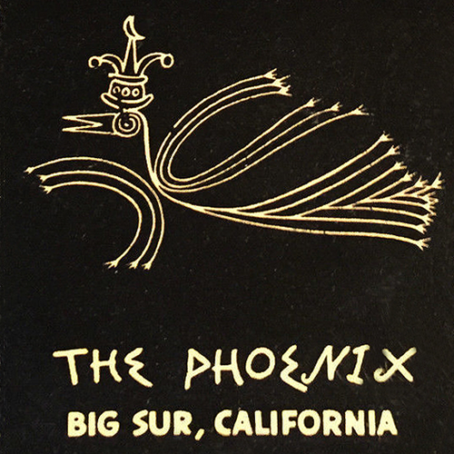

<AudioPlayer source={'http://traffic.libsyn.com/reverberationradio/Reverberation_235.mp3'} />

<a href="http://traffic.libsyn.com/reverberationradio/Reverberation_235.mp3"><b>Reverberation #235</b></a> 1. Owen Gray - Young Lover 2. Prince Buster - Call Me 3. Ambrose Campbell - Ashiko Rhythm 4. Yusef Lateef - Sister Mamie 5. Morning Echoes - I&rsquo;ve Got Jesus 6. Charles Mingus - Wednesday Night Prayer Meeting Pt. 2 7. Gato Barbieri - India 8. The Staple Singers - Wish I Had Answered 9. Nina Simone - Golden Earrings 10. Lord Invader &amp; His Calypso Rhythm Boys - Teddy Boy Calypso

