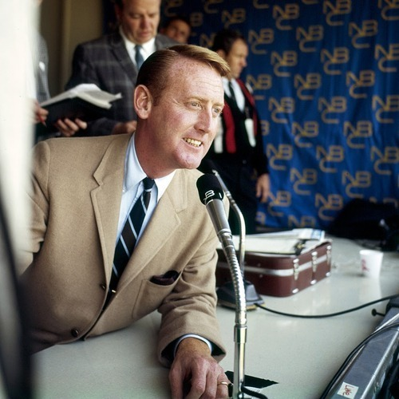

<AudioPlayer source={'https://traffic.libsyn.com/reverberationradio/Reverberation_236.mp3'} />

<b><a href="https://traffic.libsyn.com/reverberationradio/Reverberation_236.mp3">Reverberation #236</a> </b>1. Blue Cheer - I'm The Light 2. Harlan County - Oh My Head 3. Keith Law - Give A Little Time 4. Jimmie Spheeris - For Roach 5. The Third Power - Passed By 6. Bob Brown - Winds Of Change 7. Danny O'Keefe - A Country Song 8. Tudor Lodge - I See A Man 9. Waylon Jennings - Dreaming My Dreams With You

