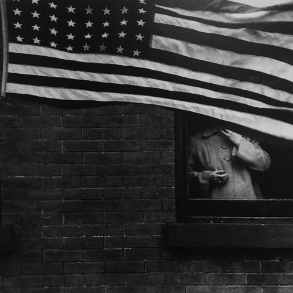

<AudioPlayer source={'https://traffic.libsyn.com/reverberationradio/Reverberation_242.mp3'} />

<b><a href="https://traffic.libsyn.com/reverberationradio/Reverberation_242.mp3">Reverberation #242</a> </b>1. Martin Rev - Trouble 2. Yoko Ono - Waiting For The Sunrise 3. Willie Thrasher - Wolves Don't Live By The Rules 4. The Insect Trust - Been Here And Gone So Long 5. G&eacute;rard Manset - La Femme Fus&eacute;e 6. Beachwood Sparks - Drinkswater 7. Hand Habits - Book On How To Change 8. Leonard Cohen - Chelsea Hotel 9. Can - Empress And The Ukraine King

