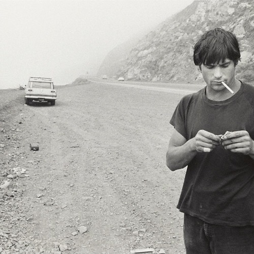

<AudioPlayer source={'http://traffic.libsyn.com/reverberationradio/Reverberation_249.mp3'} />

<b><a href="http://traffic.libsyn.com/reverberationradio/Reverberation_249.mp3">Reverberation #249</a> </b>1. Giuliano Sorgini - Under Pompelmo 2. Shintaro Sakamoto - Dancing With Pain 3. Mild High Club - Rollercoaster Baby 4. Connan &amp; Dev - Feelin' Lovely 5. Maston - Chase Theme #1 6. Leland - I've Got Some Happiness 7. Danny Kirwan - Midnight In San Juan 8. Danny Kirwan - Life Machine 9. Mild High Club - Tesselation 10. El Kinto - Suena Blanca Espuma

