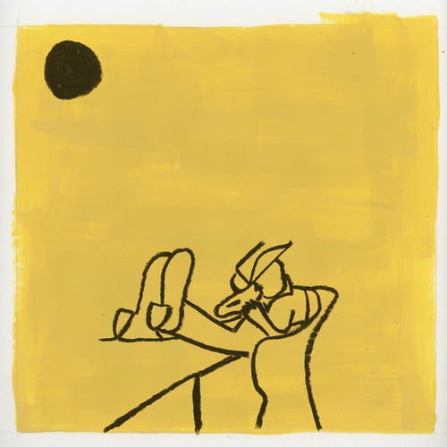

<AudioPlayer source={'http://traffic.libsyn.com/reverberationradio/Reverberation_253.mp3'} />

<b><a href="http://traffic.libsyn.com/reverberationradio/Reverberation_253.mp3">Reverberation #253</a> </b>1. Dick Diver - New Name Blues 2. Sonny Sharrock - Blind Willy 3. Persona - Lago 4. Peter Grudzien - Your Every Wish Is My Command 5. Nerve City - Sleepwalker 6. Penguin Cafe Orchestra - Penguin Cafe Single 7. Van Dyke Parks - Come To The Sunshine 8. Os Mutantes - Adeus Maria Ful&ocirc; 9. Neil Young - Little Thing Called Love 10. Euphoria - Oh Dear, You Look Like A Dog 11. The Focus Group - Jout Sections 12. Kenny Graham &amp; His Satellites - Sunday

