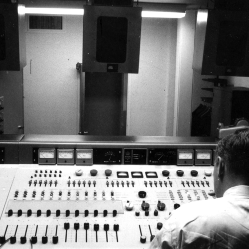

<AudioPlayer source={'http://traffic.libsyn.com/reverberationradio/Reverberation_254.mp3'} />

<b><a href="http://traffic.libsyn.com/reverberationradio/Reverberation_254.mp3">Reverberation #254</a> </b>1. Charlie Rich - Are You Still My Baby? 2. Stonewall Jackson - Why I'm Walking 3. Vincent &amp; The Charms - Tense [Demo] 4. The Hustlers - Boston Monkey 5. Cal Tjader - Evil Ways 6. Jackie Opel - Don't Take Away Your Love 7. Little Jimmie Hunter - Something's Calling 8. Mark Murphy - Senor Blues 9. Ray Price &amp; The Cherokee Cowboys - Bright Lights &amp; Blonde Haired Women 10. Patsy Cline - When Your House Is Not A Home [Live] 

