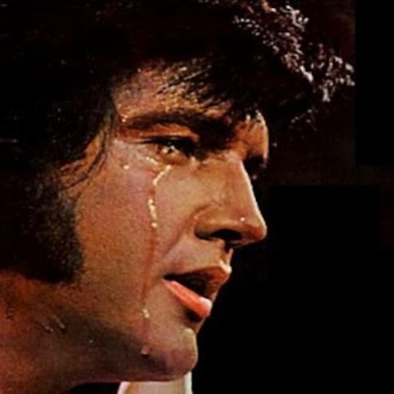

<AudioPlayer source={'https://traffic.libsyn.com/reverberationradio/Reverberation_255.mp3'} />

<a href="https://traffic.libsyn.com/reverberationradio/Reverberation_255.mp3"><b>Reverberation #255</b></a> 1. Pete Dello &amp; Friends - Do I Still Figure in Your Life 2. Ronnie Lane &amp; Slim Chance - Roll on Babe 3. The Shadows of Knight - Dark Side 4. The Kynds - So, If Someone Sends You Flowers, Babe 5. Jackson C. Frank - I Don't Want to Love You No More 6. Bee Gees - Then You Left Me 7. The Cairo Gang - Shivers 8. Alexander Skip Spence - Broken Heart 9. Bridget St. John - Back to Stay 10. David Kauffman &amp; Eric Caboor - Kiss Another Day Goodbye 

