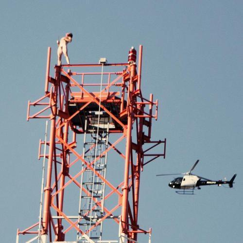

<AudioPlayer source={'https://traffic.libsyn.com/reverberationradio/Reverberation_257.mp3'} />

<b>Reverberation #257 </b>1. Dwight Sykes - Where Ever You Are 2. Universal Togetherness Band - Ain't Gonna Cry 3. Sensations Fix - Fragments Of Light 4. Donald Byrd - Estavanico 5. Phil Manzanera - Big Day 6. Yo La Tengo - Center Of Gravity 7. Peter Grudzien - Kiss Me Another 8. The Chills - Doldrums 9. The Necessaries - Rage 10. Kenny Graham &amp; His Satellites - Lullaby 11. Cleaners From Venus - At Home With Myself

