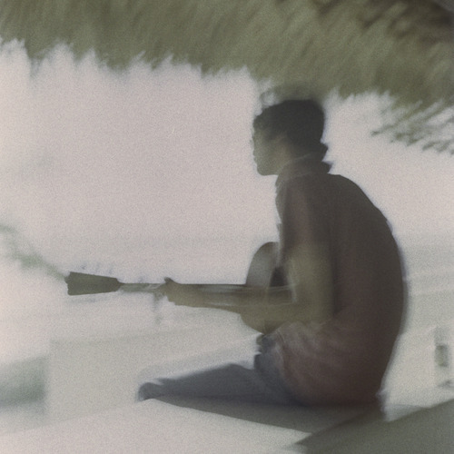

<AudioPlayer source={'http://traffic.libsyn.com/reverberationradio/Reverberation_259.mp3'} />

<b><a href="http://www.traffic.libsyn.com/reverberationradio/Reverberation_259.mp3">Reverberation #259</a> </b>1. Os Carbonos - Theme For Young Lovers 2. Terry Winter - I Know 3. James Ray - Got My Mind Set On You 4. Eumir Deodato - Os Grilos (Crickets Sing For Ana Maria) 5. Piero Piccioni - Charms (Alt. Take) 6. Toquinho &amp; Jorge Ben - Carolina Carol Bela 7. Gabor Szabo - Stormy 8. Dom Salvador - Hei! Voc&ecirc; 9. Chico Buarque &amp; Ennio Morricone - Sonho De Um Carnaval 10. Jo&atilde;o Donato - A R&atilde; 11. Trio Tenura - A Gira

