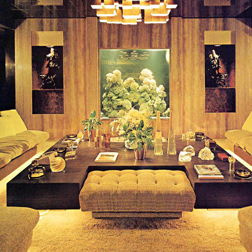

<AudioPlayer source={'https://traffic.libsyn.com/reverberationradio/Reverberation_261.mp3'} />

<b><a href="https://traffic.libsyn.com/reverberationradio/Reverberation_261.mp3">Reverberation #261</a> </b>1. Joe White - Stop, Look, Listen To Your Heart 2. Robert Hall Productions - Memories Of Spring 3. Paul Piot - Un Coolie R&eacute;commande 4. The Hangmen - The Girl Who Faded Away 5. Piero Umiliani - The City Life 6. Masahiko Sato - TBSF 7. Agincourt - Dawn 8. The Squires - Wonderin&rsquo; 9. The Loved Ones - Instant Night 10. Harmony Grass - I&rsquo;ve Seen To Dream 11. Johnny Guitar - Bangkok By Night

