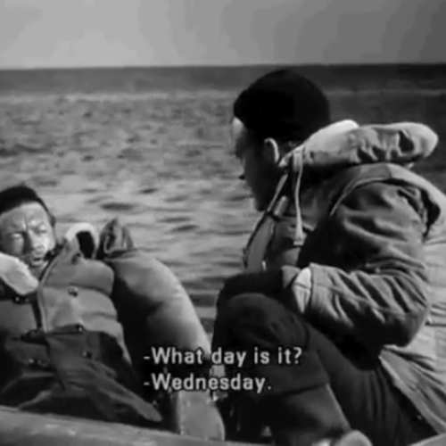

<AudioPlayer source={'https://traffic.libsyn.com/reverberationradio/Reverberation_266.mp3'} />

<b><a href="https://traffic.libsyn.com/reverberationradio/Reverberation_266.mp3">Reverberation #266</a> </b>1. Crepes - Hidden Star 2. Kyoko Furuya - Harumi Futoh 3. Andr&eacute;a Daltro - Kiu&aacute; 4. Broadcast - Tender Buttons 5. The Blank Tapes ft. Avid Dancer - Fun Machine 6. Hope Sandoval &amp; The Warm Inventions - Let Me Get There (ft. Kurt Vile) 7. Autumn - Kill My World

