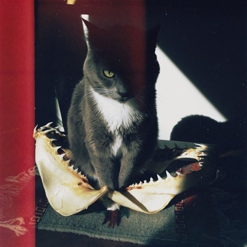

<AudioPlayer source={'https://traffic.libsyn.com/reverberationradio/Reverberation_269.mp3'} />

<b><a href="traffic.libsyn.com/reverberationradio/Reverberation_269.mp3">Reverberation #269</a> </b>1. Neno Exporta Som - Deixa A Tristeza 2. Wild Fire - The Rebels 3. Marvin Franklin With Kimo And The Guys - Kona Winds 4. Sonya Spence - Let Love Flow On 5. Michael Nesmith - Capsule (Hello Everybody 100 Years From Now) 6. Minako Yoshida - Midnight Driver 7. Sugar Babe - Downtown 8. Max Berlin&rsquo;s - Elle Et Moi

