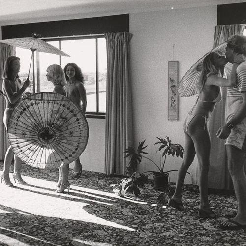

<AudioPlayer source={'http://traffic.libsyn.com/reverberationradio/Reverberation_273.mp3'} />

<a href="http://traffic.libsyn.com/reverberationradio/Reverberation_273.mp3"><b>Reverberation #273</b></a> 1. C.W. Stoneking - How Long 2. Electric Egypt - Kundalini 3. Leong Lau - Salem Abdulla 4. Justine - Wordless Song 5. The Tony Ansell Orchestra - Softly As In A Morning Sunrise 6. John Sangster - Hair 7. Steve Maxwell Von Broad - Monster Planet 8. Blekbala Mujik - Come N Dance 9. Joe Geia - Fighting For Our Rights 10. Mumbo Jumbo - Wind It Up 

#strangeyonder

