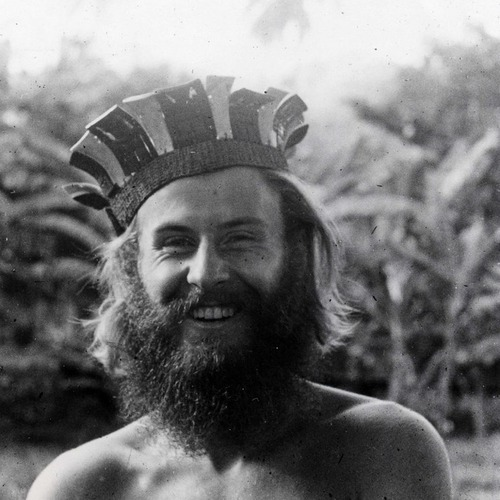

<AudioPlayer source={'https://traffic.libsyn.com/reverberationradio/Reverberation_274.mp3'} />

<b><a href="https://traffic.libsyn.com/reverberationradio/Reverberation_274.mp3">Reverberation #274</a> </b>1. Pink Floyd - The Show Must Go On 2. Gene Lawrence - After Sunrise 3. Bill Withers - Ruby Lee 4. The Chain Reaction - When I Needed You 5. Orchester Klaus Doldinger - Sitar Beat 6. The Incredible String Band - Bridge Theme 7. Sandy Coast - Capital Punishment 8. Tops - Cloudy Skies 9. The Freedom - Attraction 10. Sunbirds - Kwaeli

