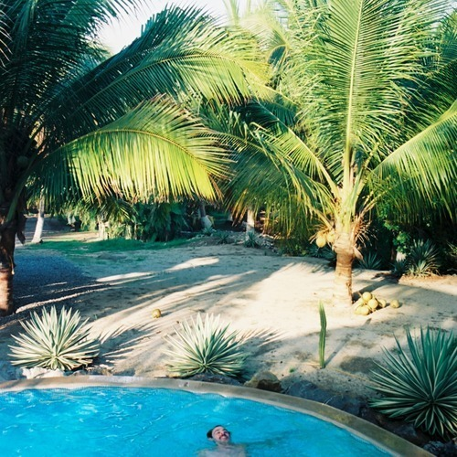

<AudioPlayer source={'http://traffic.libsyn.com/reverberationradio/Reverberation_277.mp3'} />

<b><a href="http://traffic.libsyn.com/reverberationradio/Reverberation_277.mp3">Reverberation #277</a> </b>1. Michael Hurley - Mr. Whiskerwits 2. Tom Z&eacute; - Complexo De &Eacute;pico 3. Dr. John - Mama Roux 4. Leong Lau - Another Morning 5. Cymande - Bra 6. Prinz &amp; Prinz - Einsamkeit 7. Mal&ouml;r - Bali 8. Letta Mbulu - Mahlalela

