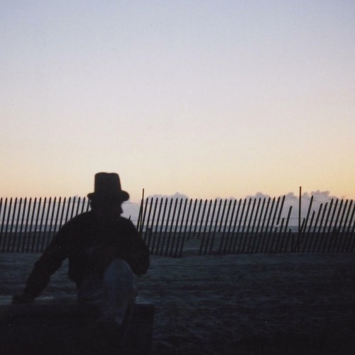

<AudioPlayer source={'https://traffic.libsyn.com/reverberationradio/Reverberation_281.mp3'} />

<b><a href="https://traffic.libsyn.com/reverberationradio/Reverberation_281.mp3">Reverberation #281</a> </b>1. &#21205;&#29289;&#19990;&#30028; - &#40441; 2. Abeti Masikini- Usisilike 3. Le Pamplemousse - Gimme What You Got 4. Jean-Claude Pelletier - Hello Streakers! 5. Laid Back - Fly Away 6. Laid Back - Walking In The Sunshine 7. Eddie Hooper - Tommorows Sun 8. Lucio Battisti - Amarsi Un Po'

