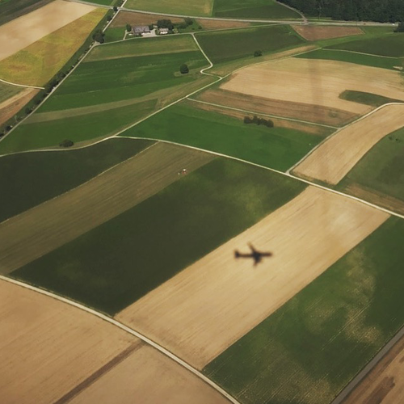

<AudioPlayer source={'http://traffic.libsyn.com/reverberationradio/Reverberation_282.mp3'} />

<a href="http://traffic.libsyn.com/reverberationradio/Reverberation_282.mp3"><b>Reverberation #282</b> </a>1. Flo &amp; Eddie - I Been Born Again 2. Baiano E Os Novos Caetanos - Dendalei 3. Chris Lucey - That's The Way The World Has Got To Be (Pt. 1) 4. Bruxas - M&aacute;s Profundo 5. Bryan Ferry - Casanova 6. Mata Hari - Easy 7. Ronnie Foster - Summer Song 8. 10cc - The Worst Band In The World 9. Once and Future Band - Destroy Me 

