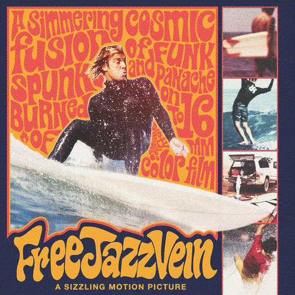

<AudioPlayer source={'https://traffic.libsyn.com/reverberationradio/Reverberation_284.mp3'} />

<b><a href="https://traffic.libsyn.com/reverberationradio/Reverberation_284.mp3">Reverberation #284</a> </b>1. Beastie Boys - &nbsp;Bobo On The Corner 2. ESG - Chistelle 3. Marvin Gaye - After The Dance 4. MMR ADM - Song 013 5. Miles Davis - Nne Part 2 6. CAN - Dead Pigeon Suite 7. Miles Davis - On The Corner 8. The Dwarfs of East Agouza - Clean Shahin 9. Byron Lee &amp; The Dragonaires - Bridge Over Troubled Waters

