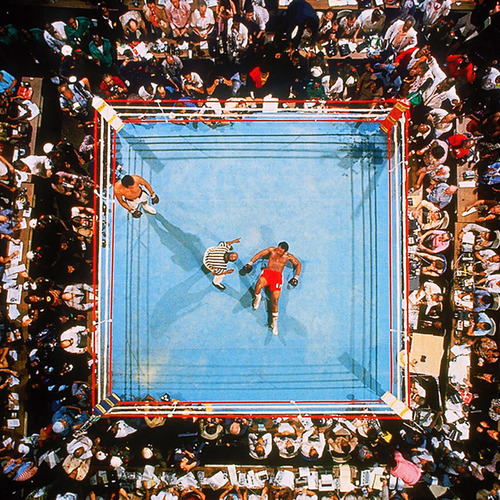

<AudioPlayer source={'http://traffic.libsyn.com/reverberationradio/Reverberation_287.mp3'} />

<b><a href="http://traffic.libsyn.com/reverberationradio/Reverberation_287.mp3">Reverberation #287</a> </b>1. Gene Harris - Losalamitoslatinfunklovesong 2. Arthur Verocai - Na Boca do Sol 3. Alice Coltrane - Govinda Jai Jai 4. James Vincent - Space Traveler 5. Gimmer Nicholson - Millenial Harbinger 6. Yves Tumor - The Feeling When You Walk Away 7. Donald Byrd - (Fallin' Like) Dominoes 8. Autumn &ndash; Kill My World 9. Nef - Le Miroir Sur Le Dos, B) A Chaque Bout 10. Franco Battiato - A Cell

