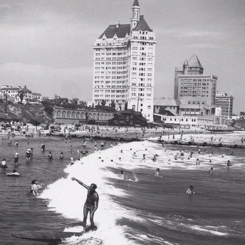

<AudioPlayer source={'https://traffic.libsyn.com/reverberationradio/Reverberation_288.mp3'} />

<a href="https://traffic.libsyn.com/reverberationradio/Reverberation_288.mp3"><b>Reverberation #288</b></a> 1. Jim Waller &amp; The Deltas - Latin&rsquo;ia 2. Dinah Shore - Scene Of The Crime 3. Centurions - Ishamatsu 4. Groupies - Primitive 5. New Dimensions - Bongo Shutdown 6. Original Surfaris - Failsafe 7. Sunny &amp; The Sunliners - Put Me In Jail 8. Crystals - Another World 9. Beach Boys - Girl Don&rsquo;t Tell Me (Alt. Vocal) 10. The Lovin&rsquo; Spoonful - Young Girl (Take 1)

