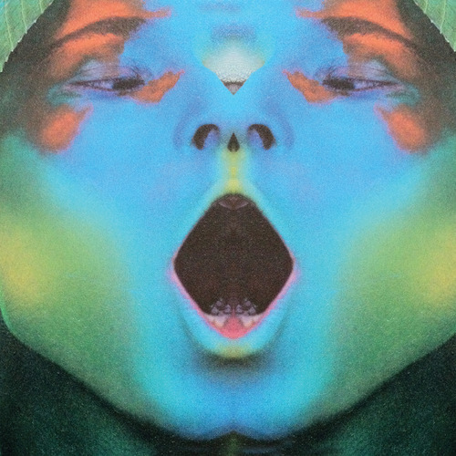

<AudioPlayer source={'https://traffic.libsyn.com/reverberationradio/Reverberation_290.mp3'} />

<b><a href="https://traffic.libsyn.com/reverberationradio/Reverberation_290.mp3">Reverberation #290</a> </b>1. Uku Kuut - Vision Of Estonia (Demo) 2. Hot Chocolate - Put Your Love In Me 3. The Zodiac - Taurus : The Voluptuary 4. Dexter Story &amp; Nia Andrews - Eastern Prayer 5. Frank Ocean - Comme Des Gar&ccedil;ons 6. Shadow - Without Love 7. Nef - Apparition A L'Endroit 8. Hortense Ellis - I'm Still In Love 9. Moondog - Single Foot 10. Donald Byrd - Lansana's Priestess

