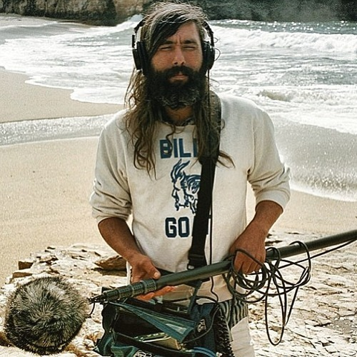

<AudioPlayer source={'https://traffic.libsyn.com/reverberationradio/Reverberation_291.mp3'} />

<b><a href="https://traffic.libsyn.com/reverberationradio/Reverberation_291.mp3">Reverberation #291</a> </b>1. Czerwone Gitary - Coda 2. Topanga Canyon - Seeing 3. The Nassauvians - Slacking Off 4. Frederic Castel - Open Up 5. Bernard Chabert - Il Part En Californie 6. Gino Soccio - Dream On 7. The Group NSI - Moin Epi Vou 8. Douglas Wood - Moon Nightclub 9. Jeanette - L'Amour Joue Au Violon 10. Laid Back - Blue Lagoon 11. Kava Kon - Journey Home

